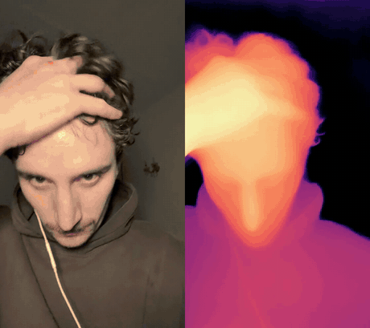
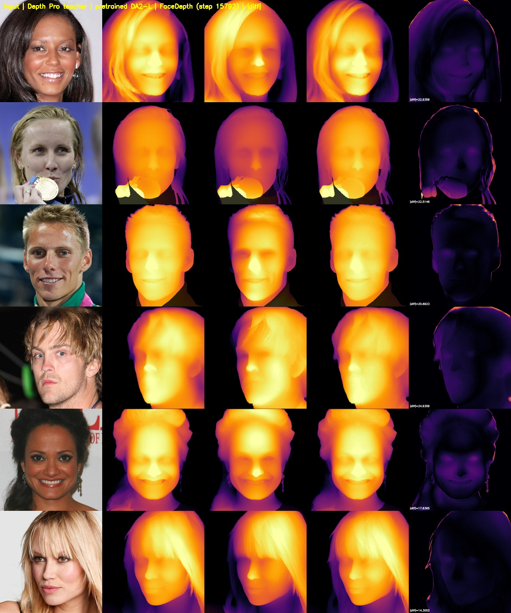
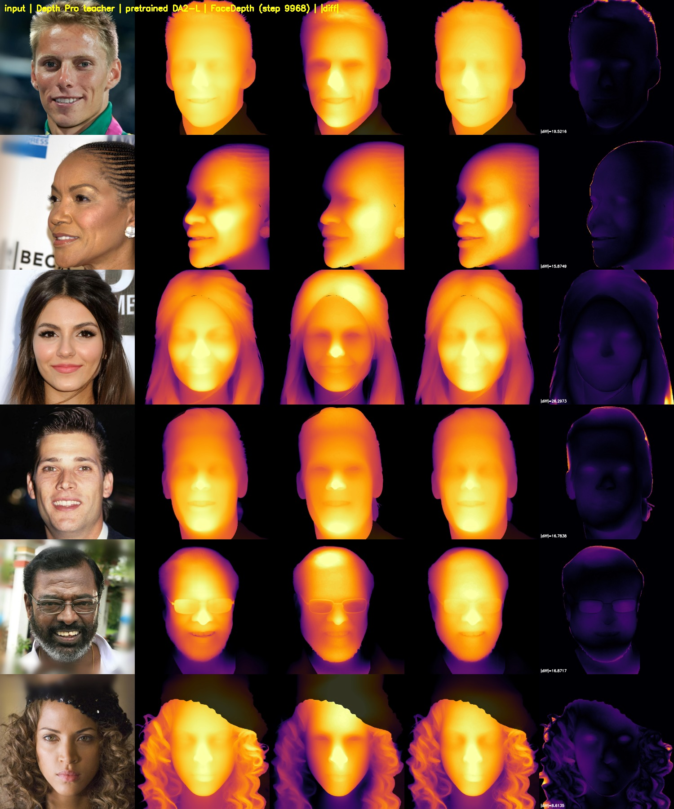
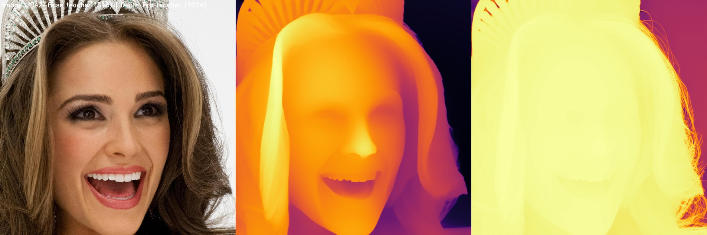
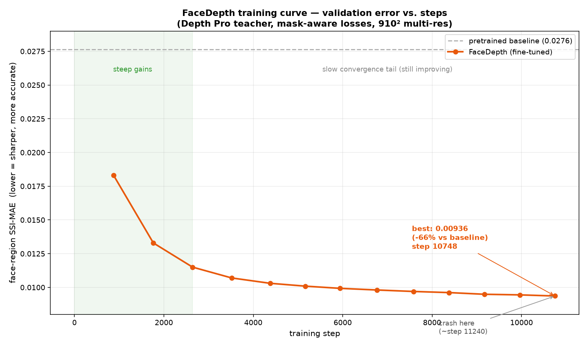

# FaceDepth

Face-specialized monocular depth estimation. One photo in, sharp facial relief out, with no depth sensor.

[](https://huggingface.co/a-ml/FaceDepth)
[](paper.md)
[](https://instagram.com/aristides.lab)
[](#license-and-provenance)

General depth models train on streets, rooms, and furniture, so they flatten a face into a smooth blob. A face holds its information in millimeters of relief, the bridge of the nose against the cheek, the small step from lid to eyeball, and that signal sits far below what a scene-trained model represents. Face relighting, avatar capture, and AR effects need the part those models throw away.

FaceDepth is a Depth Anything V2-Large variant tuned to keep that detail. It resolves the eyelid crease, the nostril rim, the lip contour, and the hairline.



*Source on the left, FaceDepth on the right. [Full-quality MP4](figures/facedepth_video_demo.mp4).*

## Results

Measured on 500 held-out faces.

| metric | baseline DA2-Large | FaceDepth | change |
|---|---|---|---|
| face-region SSI-MAE | 0.02764 | **0.00906** | **−67%** |
| depth-edge F1 vs reference | 0.717 | **0.882** | **+23%** |
| edge recall vs reference | 0.745 | **0.873** | +17% |
| edge precision vs reference | 0.694 | **0.893** | +29% |

Edge metrics are density-matched at 5% of in-face gradient pixels with a 2-pixel tolerance, so a blurry model cannot win by spreading weak gradients across the whole face. Recall and precision both rise, so the model finds real depth edges and stops inventing ones that are not there.



*Left to right: input, reference depth, baseline DA2-Large, FaceDepth, and the difference between the last two. Depth is normalized inside the face mask so relief stays visible. Compare columns three and four against column two.*



*Six more held-out faces, same layout. The difference column concentrates on the face interior and hairline.*

## Download

| file | format | size | notes |
|---|---|---|---|
| `FaceDepth_step15792.pt` | PyTorch | 2.5 GB | full checkpoint. Use the `ema_model` key. |
| `coreml/FaceDepth_fp32.mlpackage` | Core ML | 1.2 GB | unquantized reference, 5.4 fps |
| `coreml/FaceDepth_fp16.mlpackage` | Core ML | 668 MB | **realtime, 40.5 fps, Neural Engine** |
| `coreml/FaceDepth_int8.mlpackage` | Core ML | 335 MB | 39.4 fps, smallest, GPU |

All from [huggingface.co/a-ml/FaceDepth](https://huggingface.co/a-ml/FaceDepth). Every Core ML export correlates at 1.00000 against the PyTorch reference. Benchmarks use 392×518 input on an Apple-silicon laptop with `ComputeUnit.ALL`, averaged over 20 runs after warmup.

On this hardware int8 buys a 2× size reduction rather than speed, so its advantage is the app bundle. The ranking may differ on iPhone, where the Neural Engine is relatively stronger, and that has not been measured.

## Quick start

```python
import numpy as np, coremltools as ct
from PIL import Image

model = ct.models.MLModel("coreml/FaceDepth_fp16.mlpackage",
                          compute_units=ct.ComputeUnit.ALL)
img = Image.open("face.jpg").convert("RGB").resize((392, 518))
disp = np.asarray(model.predict({"image": img})["depth"]).reshape(518, 392)
# inverse depth: larger = nearer
```

ImageNet normalization is folded into the graph, so pass raw pixels.

**Normalize for display inside the face, not across the frame.** A whole-frame min-max collapses the face's range the moment a distant background enters the shot, which reads as a black or washed-out face. This one detail causes most of the "the model looks broken" reports.

```python
lo, hi = np.percentile(disp, 2), np.percentile(disp, 98)
norm = np.clip((disp - lo) / (hi - lo), 0, 1)   # 1 = nearest
```

## Video

[`video_depth.py`](video_depth.py) converts any video ffmpeg can read, up to 4K, into a depth-map video. Frames stream through an ffmpeg pipe, so a long clip never lands on disk as a frame dump and memory stays flat. A progress bar reports frames per second and ETA.

```bash
# depth only
python video_depth.py --input clip.mov --output depth.mp4 --ckpt FaceDepth_step15792.pt

# side by side, source on the left
python video_depth.py --input clip.mov --output sbs.mp4 --side-by-side --colormap magma

# handheld footage, damp the residual jitter
python video_depth.py --input clip.mp4 --output out.mp4 --smooth-depth 0.3 --bf16
```

Useful flags:

| flag | what it does |
|---|---|
| `--colormap` | inferno, magma, turbo, viridis, plasma, bone, gray |
| `--res` | model resolution, default 910. Higher is sharper and slower. |
| `--side-by-side` | source on the left, depth on the right |
| `--range-ema` | smooths the near/far range across frames. On by default, no ghosting. |
| `--smooth-depth` | smooths depth across frames. Off by default. Cuts jitter, ghosts on fast motion. |
| `--bf16` | roughly 2× faster, negligible quality cost |
| `--invert` | flip so near reads dark |

Needs `ffmpeg` on PATH and [Depth-Anything-V2](https://github.com/DepthAnything/Depth-Anything-V2) cloned into `third_party/DepthAnythingV2`. Runs on Apple silicon, CUDA, or CPU.

## How it works

FaceDepth is distilled from a boundary-accurate high-resolution depth model, and supervised with losses guided by face parsing so the error signal concentrates on the features that carry a face rather than on the background. The parsing masks drive three things: they restrict scale alignment to the head, weight the gradient term toward eyes, brows, nose, and lips, and place an extra penalty at feature boundaries.

The teacher sets the ceiling. No student grows sharper than the labels it learns from, which makes that choice the dominant lever in the whole recipe.



*Left to right: input, a general depth model at 518 px, the boundary-accurate reference at 1024 px. The reference separates individual hair strands where the general model gives a smooth gradient.*



Error drops steeply early, then grinds down for another 14,000 steps as the model refines fine structure. A machine crash partway through cost nothing: the run resumed from its last checkpoint and continued below the pre-crash best. Everything ran on one Apple-silicon laptop. No cluster, no cloud GPU.

## An evaluation result worth reading

The first protocol scored depth edges against every parsed feature edge at a fixed gradient threshold. It ranked the sharpest model **last** and implied that tuning hurt.

Two flaws produced that. Feature masks mark semantic boundaries, an eyebrow or a color line, which are often depth-flat. And a fixed threshold rewards a diffuse model whose weak gradients drift across those boundaries, which showed up as its precision of 0.155. Density matching against real depth edges removes both, and the corrected numbers agree with the error curve and the images.

The flawed protocol was internally consistent and would have supported the opposite conclusion. Section 4 of [paper.md](paper.md) documents it.

## Limitations

This model optimizes single-image sharpness, so live video flickers more than a temporally stabilized model would. For offline video, `video_depth.py` damps that with `--range-ema` and `--smooth-depth`.

Detail is capped by the reference the model learned from. The claim is sharp feature relief and boundaries, not sub-millimeter texture. Per-eyelash depth is beyond what any current monocular model resolves.

Training data is centered, well-lit, and limited in pose, occlusion, and demographic diversity relative to in-the-wild use. Performance by demographic group has not been measured. Evaluate before deploying on populations or capture conditions that differ from the training distribution.

## License and provenance

Released under **CC-BY-NC-4.0**, non-commercial research use.

FaceDepth derives from [Depth Anything V2-Large](https://huggingface.co/depth-anything/Depth-Anything-V2-Large), which is CC-BY-NC-4.0. It builds on [Apple Depth Pro](https://github.com/apple/ml-depth-pro) and [CelebAMask-HQ](https://github.com/switchablenorms/CelebAMask-HQ), whose terms restrict use to non-commercial research and education. Honor the upstream terms of all three.

## Contact

[@aristides.lab](https://instagram.com/aristides.lab) on Instagram.

## Citation

```bibtex
@software{facedepth2026,
  title  = {FaceDepth: Face-Specialized Monocular Depth Estimation},
  author = {Lintzeris, Aristides},
  year   = {2026},
  url    = {https://github.com/AristidesAI/FaceDepth}
}
```

Please also cite the work this builds on: Depth Anything V2 ([arXiv:2406.09414](https://arxiv.org/abs/2406.09414)), Depth Pro ([arXiv:2410.02073](https://arxiv.org/abs/2410.02073)), MiDaS ([arXiv:1907.01341](https://arxiv.org/abs/1907.01341)), DPT ([arXiv:2103.13413](https://arxiv.org/abs/2103.13413)), DINOv2 ([arXiv:2304.07193](https://arxiv.org/abs/2304.07193)), and CelebAMask-HQ ([arXiv:1907.11922](https://arxiv.org/abs/1907.11922)). Full reference list in [paper.md](paper.md#7-references).
