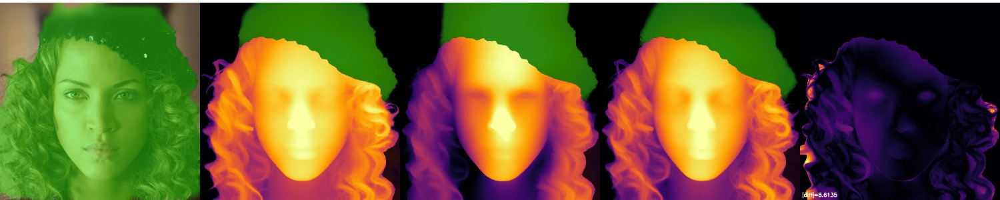

# FaceDepth
A Finetuned DAV2 varient trained on onemillioncelebs & CelebA-HQ. Created specifically for Depthmapping faces. 

"We Present" we being me myself and I and AWS Sagemaker & claude a little bit, present FaceDepth, A finetuned DepthAnythingV2-Large varient trained using DepthPro Teacher Student methodology 

General-purpose depth models are trained overwhelmingly on scenes and interiors and consequently smooth away the fine relief that dominates a face, the lid crease, the nostril rim, the lip contour, the hairline. Humankind also has a deep variety in the depth of faces, some of us have sharp features, while others flatter faces, Using our large database of onemillioncelebs & CelebA-HQ. FaceDepth is trained by distilling a boundary-accurate, high-resolution teacher (Apples Depth Pro) into a DINOv2 student (DepthAnythingV2-Large), supervised by three mask-aware losses derived from Onemillioncelebs & CelebAMask-HQ face-parsing annotations: 

#### foreground-restricted scale-and-shift-invariant term 
#### feature-weighted gradient-matching term on the depth residual
#### boundary term that ties depth discontinuities to true feature edges with optional learned per-pixel confidence head lets the student down-weight regions the teacher labels unreliably. 

Monocular depth estimation improved fast, and the strongest general models still treat a face as a near-frontal lump. Their training data is scenes, streets, and interiors, so they optimize for the geometry that dominates those images: walls, floors, the gross layout of a room. A face carries its information in millimeters of relief, the bridge of the nose against the cheek, the small step from lid to eyeball, and that signal sits far below what a scene-trained model bothers to represent. Face relighting, avatar capture, artistic representation and AR effects need exactly the part these models throw away.

Two obstacles block a face-specialized model. No ground-truth depth exists for in-the-wild face photos, so the supervision has to come from another model, and the student can never grow sharper than that teacher. Second, a face's informative depth spans a small fraction of the scene range, so a loss that weights every pixel the same spends its budget on the background and the hair and under-fits the features that carry the face. A model can score well by getting the coarse face-versus-background gap right while smoothing every eyelid and lip into mush.

We attack both. For supervision we replace the usual general teacher with Depth Pro [dp], built for crisp object boundaries at high native resolution. On face crops it resolves individual hair strands and the relief of the lid and iris where our previous general teacher produced a smooth gradient (Figure 1). For the loss we read CelebAMask-HQ [celebamaskhq] per-feature segmentation and make the supervision face-aware: we align the depth scale over the head alone, weight the gradient term toward eyes, brows, nose, and lips, and add a term at parsed feature edges.